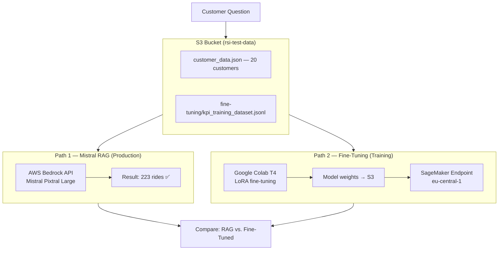

# Mistral RAG vs. Fine-Tuning — A GDPR/DSGVO Compliance Analysis

[](https://aws.amazon.com/bedrock/)
[](https://python.org)
[](https://gdpr.eu)

A case study comparing **Retrieval-Augmented Generation** and **Fine-Tuning** for GDPR-compliant AI in the mobility sector. Built with agentic coding workflows by [LeopardCode.AI](https://leopardcode.ai).

---

## Abstract

This project compares two approaches for privacy-compliant AI model adaptation within the European legal framework: **Retrieval-Augmented Generation (RAG)** via AWS Bedrock using a European language model (Mistral Pixtral Large), and **Fine-Tuning** of an open-weights model (Mistral 7B) with LoRA on a free T4 GPU in Google Colab.

A synthetic dataset of 20 ride-sharing customers with twelve KPI question-answer pairs serves as the case study. **RAG achieved 100% accuracy (223 of 223 rides correctly identified), while the fine-tuned model's 4-bit quantized inference produced unusable output due to quantization rounding errors.**

[📄 Read the full paper →](docs/PAPER.md)

---

## Results

| Approach | Accuracy | Duration | GDPR | Production Ready |
|----------|----------|----------|:----:|:----------------:|
| **Mistral RAG** (Bedrock, eu-central-1) | **100%** | ~3 s | ✅ | ✅ Yes |
| **Mistral 7B Fine-Tuned** (4-bit, Colab T4) | **0%** | ~15 min | ✅ | ❌ No |
| distilgpt2 Fine-Tuned | 100% | ~15 min | ✅ | ⚠️ Toy only |
| Gemma 3 1B Fine-Tuned | not tested | — | ✅ | — |

**Key finding:** Under realistic resource constraints, RAG delivers more accurate results. Fine-tuning with LoRA on a T4 GPU is technically feasible, but inference suffers from hardware limitations (4-bit quantization rounding errors).

---

## Architecture

All data resides in **eu-central-1 (Frankfurt)**.



| | Path 1 — Mistral RAG | Path 2 — Mistral 7B Fine-Tuning |
|---|---|---|
| **Infrastructure** | AWS Bedrock (no GPU) | Colab T4 → S3 → SageMaker |
| **Training** | None required | LoRA, 5–10 min on T4 |
| **Inference** | `scripts/query_mistral_db.py` | `scripts/query_mistral7b_endpoint.py` |
| **Region** | eu-central-1 | eu-central-1 (deployment) |

---

## GDPR/DSGVO Compliance Check

| Criterion | Mistral RAG (Path 1) | Fine-Tuning (Path 2) |
|-----------|:--------------------:|:--------------------:|
| Data in EU (training) | ✅ Yes | ⚠️ Colab US → returned to EU |
| Data in EU (inference) | ✅ Yes (Frankfurt) | ✅ Yes (Frankfurt) |
| EU-based model | ✅ Yes (Mistral, France) | ✅ Yes (Mistral 7B open-weights) |
| Production-ready | ✅ Yes | ⚠️ Requires GPU quota |
| AWS infrastructure | ✅ Art. 28 GDPR compliant | ✅ Art. 28 GDPR compliant |

**Result:** Both architectures meet GDPR requirements with proper configuration. RAG is immediately production-ready.

---

## Project Structure

```
.
├── README.md
├── .env.example                     # AWS credentials template
│
├── data/                            # Datasets
│   ├── customer_data.json           # 20 synthetic ride-share customers
│   └── kpi_training_dataset.jsonl   # 12 Q&A pairs for fine-tuning
│
├── scripts/                         # Python & Bash scripts
│   ├── create_fake_data.py          # Generate synthetic customers
│   ├── upload_to_s3.py              # Upload data to S3
│   ├── query_mistral_db.py          # Path 1: Mistral RAG
│   ├── query_claude_rag.py          # Comparison: Claude RAG
│   ├── query_llama_rag.py           # Comparison: Llama RAG
│   ├── query_mistral7b_endpoint.py  # Query fine-tuned Mistral 7B
│   ├── compare_pipelines.py         # Compare both paths
│   ├── prepare_fine_tuning.py       # Upload fine-tuning dataset to S3
│   ├── colab_mistral7b_final.py     # Colab: Mistral 7B fine-tuning
│   ├── colab_fine_tuning_gemma3.py  # Colab: Gemma 3 1B
│   ├── colab_gemma3_full.py         # Colab: Gemma 3 complete
│   ├── aws_mistral7b_endpoint.py    # Deploy Mistral 7B to SageMaker
│   ├── setup.sh                     # Automated setup
│   └── check_bedrock_custom.py      # Check Bedrock custom models
│
├── configs/                         # Configuration files
│   ├── config.json                  # Bedrock configuration
│   ├── bedrock_and_s3_policy.json   # IAM policy
│   ├── fine_tuning_config.json      # Bedrock customization config
│   └── ec2-trust-policy.json        # EC2 trust policy
│
├── models/                          # Fine-tuned model weights
├── docs/                            # Documentation
│   ├── PAPER.md                     # Full academic paper
│   ├── ARCHITEKTUR.md               # Detailed architecture
│   ├── DSGVO_ARCHITEKTUR.md         # GDPR status & limitations
│   └── COLAB_GUIDE.md               # Google Colab guide
│
└── tests/
```

---

## Quick Start

### 1. Mistral RAG (no training required)
```bash
python3 scripts/query_mistral_db.py
# → "The sum of all rides is 223."
```

### 2. Fine-tune Mistral 7B in Google Colab
```bash
# 1. Enable the T4 GPU runtime in Colab
# 2. Add AWS credentials to colab_mistral7b_final.py
# 3. Run: !python colab_mistral7b_final.py
# Training takes 5–10 min; the model is uploaded to S3
```

### 3. Deploy the fine-tuned model to SageMaker
```bash
python3 scripts/aws_mistral7b_endpoint.py
# Deployed in eu-central-1 (Frankfurt)
```

### 4. Compare results
```bash
python3 scripts/compare_pipelines.py
```

---

## Discussion

### When to use RAG
- Small to medium structured datasets
- Frequently changing data
- No GPU infrastructure available
- Deterministic answers grounded in source data
- Hallucination resistance — the model receives facts as context

### When to use Fine-Tuning
- Stylistic adaptation (specific response formats)
- Large unstructured text corpora
- Latency-critical applications (no retrieval step)

### Limitations of this study
- Small dataset: 20 customers, 12 Q&A pairs
- Synthetic data, not production data
- T4 GPU (15 GB VRAM) forced 4-bit quantization
- Single run per configuration, no A/B testing

---

## Resources

- [Full Paper](docs/PAPER.md)
- [Architecture Overview](docs/ARCHITEKTUR.md)
- [GDPR Compliance Details](docs/DSGVO_ARCHITEKTUR.md)
- [Google Colab Guide](docs/COLAB_GUIDE.md)
- [LeopardCode.AI — AI Engineering & Consulting](https://leopardcode.ai)

---

<p align="center">
  <sub>Built with agentic coding workflows by <a href="https://leopardcode.ai">LeopardCode.AI</a></sub><br>
  <sub>Dr. Alexander Brunker — AI Engineering &amp; Consulting</sub>
</p>
